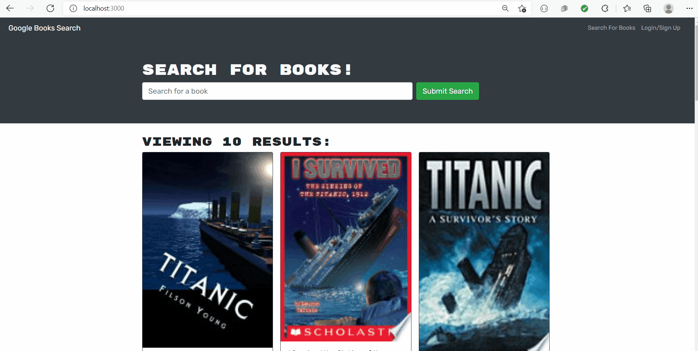

<h1 align="center">BOOK SEARCH ENGINE 👋</h1>

## Description

*Book Search Engine is an application that allows the users to search for their desired books using Googlr publicly available API. The application uses MERN stack and it is connected by Apollo Server and Apollo Provider node packages. In this application the user has the option to signup, login and search for the books and there has the option to save the books, retrieve the saved books and also delete the books. Without login to the application, the user also has the option to search for the book, but at that time he/she will not have the option to save the books. This is a very updated and timely software.*


## Table of Contents

- [Description](#description)
- [Table of Contents](#table-of-contents)
- [App Screenshots](#app-screenshots)
- [Overview Links](#overview-links)
- [User Story](#user-story)
- [Acceptance Criteria](#acceptance-criteria)
- [Installation](#installation)
- [Tools](#tools)
- [Usage](#usage)
- [Questions](#questions)


## App Screenshots
- Picture of the Application.


- Gif for login-signup


- Gif for search my book


- Gif for Saved books and Delete option.


- Gif for Search without login.


## Overview Links
- [Application walkthrough](https://watch.screencastify.com/v/EQQzhuBWwAAufNYd451Q)

- [Application Deployed in Heroku](https://book-search-engine-mirza.herokuapp.com/)

- [Github link](https://mirzadev.github.io/Book-Search-Engine/)


## User Story

```text
AS AN avid reader
I WANT to search for new books to read
SO THAT I can keep a list of books to purchase
```

## Acceptance Criteria

```text
GIVEN a book search engine
WHEN I load the search engine
THEN I am presented with a menu with the options Search for Books and Login/Signup and an input field to search for books and a submit button
WHEN I click on the Search for Books menu option
THEN I am presented with an input field to search for books and a submit button
WHEN I am not logged in and enter a search term in the input field and click the submit button
THEN I am presented with several search results, each featuring a book’s title, author, description, image, and a link to that book on the Google Books site
WHEN I click on the Login/Signup menu option
THEN a modal appears on the screen with a toggle between the option to log in or sign up
WHEN the toggle is set to Signup
THEN I am presented with three inputs for a username, an email address, and a password, and a signup button
WHEN the toggle is set to Login
THEN I am presented with two inputs for an email address and a password and login button
WHEN I enter a valid email address and create a password and click on the signup button
THEN my user account is created and I am logged in to the site
WHEN I enter my account’s email address and password and click on the login button
THEN I the modal closes and I am logged in to the site
WHEN I am logged in to the site
THEN the menu options change to Search for Books, an option to see my saved books, and Logout
WHEN I am logged in and enter a search term in the input field and click the submit button
THEN I am presented with several search results, each featuring a book’s title, author, description, image, and a link to that book on the Google Books site and a button to save a book to my account
WHEN I click on the Save button on a book
THEN that book’s information is saved to my account
WHEN I click on the option to see my saved books
THEN I am presented with all of the books I have saved to my account, each featuring the book’s title, author, description, image, and a link to that book on the Google Books site and a button to remove a book from my account
WHEN I click on the Remove button on a book
THEN that book is deleted from my saved books list
WHEN I click on the Logout button
THEN I am logged out of the site and presented with a menu with the options Search for Books and Login/Signup and an input field to search for books and a submit button  
Mock-Up
```

## Installation
💾     
- npm install
- npm i apollo-server-express graphql
- npm install jsonwebtoken
- npx create-react-app client
- npm i @apollo/client graphql
- npm install -D concurrently
- npm install react-router-dom
- npm i jwt-decode

## Tools
- NodeJS
- MongoDB
- Mongoose
- Apollo
- React
- Graphql
- Google Book API

## Usage
💻   
  
Run the following command at the terminal:
  
`npm start`

## Questions
✉️ Contact me with any questions: [email](mailto:awal.mirza2016@gmail.com) , [LinkedIn](https://www.linkedin.com/in/mirza-awal-5972511b5/)
